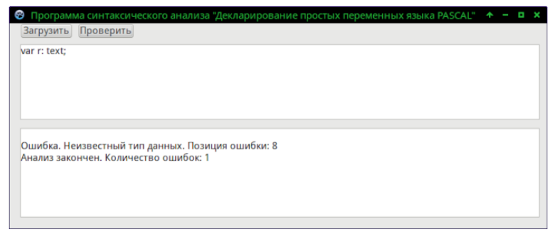
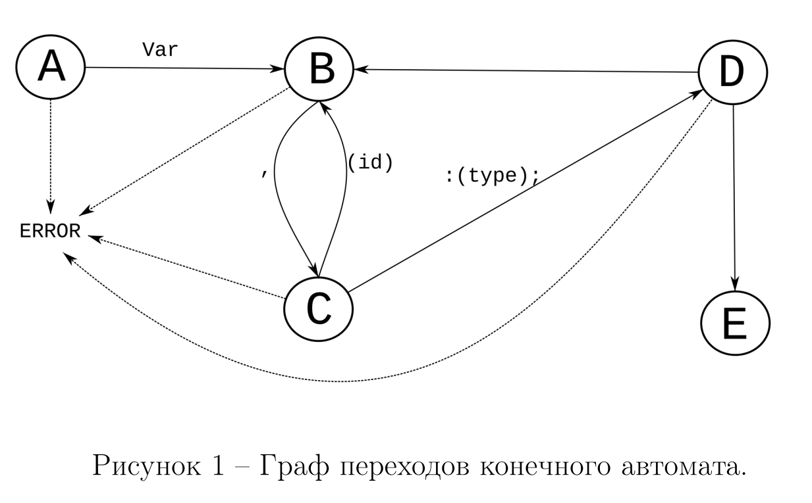

# Piece of pascal

Реализация программы для анализа синтаксиса декларирования простых переменных на IDE Lazarus c графическим интерфейсом.

Пример работы программы:



Построение алгоритма синтаксического анализа "*Декларирование простых переменных языка PASCAL*"

# Подбор порождающей грамматики

Типичное декларирование переменных в паскале выглядит так:

```
var bo,bo1:BOOLEAN;i:integer;r:REAL;c:CHAR;
```

Пусть `Id = {<Буква> | <Буква >{<Буква> | <Цифра> | _ }`, Буква –
буква латинского алфавита, Цифра – целое число.

Тогда формальная грамматика декларирования простых переменных в
языке паскаль будет:

```
𝐺[𝐴]
𝐴− > 𝑣𝑎𝑟𝐵|
𝐵− > (𝑖𝑑)𝐶
𝐶− > 𝐵 : (𝑡𝑦𝑝𝑒); 𝐷
𝐷− > 𝐵|
```

где < 𝑖𝑑 > — идентификатор переменной, < 𝑡𝑦𝑝𝑒 > — название типа
данных.


# Классификация

Грамматика `𝐺[𝐴]`, описанная в предыдущей главе, относится к классу
автоматной, так как все входящие правила имеют вид `𝐴− > 𝑎|𝑎𝐵|`.

Автоматные грамматики отличаются тем, что в их правилах вместо
цепочки терминальных символов присутствует только один терминальный
символ.

По классификации Хомского, данная грамматика относится к контекстно-свободным.

# Алгоритм



## Метода анализа

### Синтаксический анализ

К данной грамматики применим нисходящей алгоритм Эрли.

Перед началом синтаксического анализа будет выполнен лексический
анализ входной строки. Результатом работы лексического анализатора будет
список лексем, подаваемый на вход синтаксического анализатора.

Таким образом итоговый алгоритм будет содержать цепочку вызовов
функций, где каждая функция соответствует контексту (*наборы состояний*).
В каждой функции происходит посимвольный перебор предложения на
наличии соответствующих грамматике символов (*предсказание*). Также в
этих функциях происходит диагностика и нейтрализация ошибок.

В данной грамматике используется следующий список состояний:

1. Стартовый символ грамматики (Ключевое слово `var` )
2. Идентификатор переменной
3. Символ разделитель (запятая)
4. Тип данных
5. Терминальный символ (точка с запятой)

### Нейтрализация ошибок

Для нейтрализации ошибок был использован метод Айронса. При
обнаружении ветви в дереве, приводящие к недопустимому состоянию, данная
ветка будет отброшена или перестроенная в зависимости от состояния. При
обнаружении ошибки, пользователю будет выведена позиция некорректного
символа, а символ, который ожидался алгоритмом.
